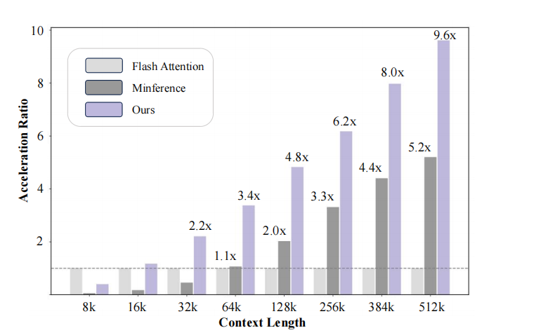

She is currently a graduate student in Basic Medicine at the School of Medicine, South China University of Technology, with a research focus on the application of computer technology in the medical field.

#### Contact

Email: wanxuanli127[at]gmail.com

#### Education
M.E., Basic Medicine, South China University of Technology, 2023—2026.\
B.E., Biomedical Engineering, Shenyang Pharmaceutical University, 2019—2023.

#### Research Interests
Deep Learning, Artificial Intelligence Medicine, Technology and Health.

### test_png

